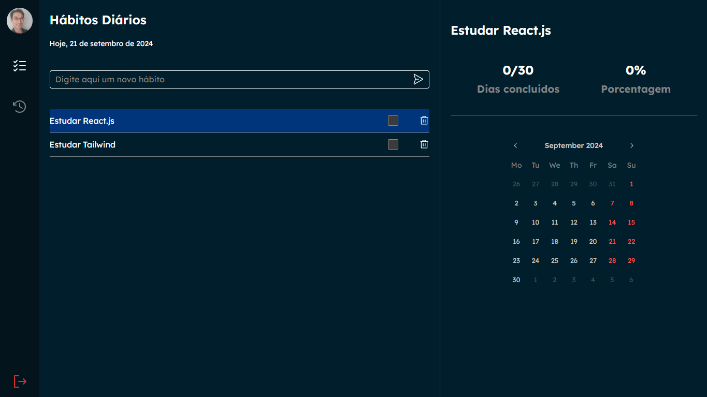
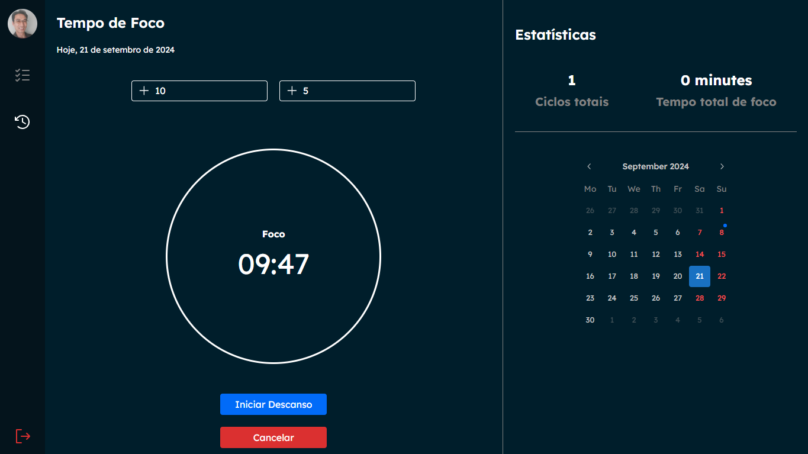

# Elite Traker

## Índice

- [Visão Geral](#visão-geral)
  - [Imagens](#Imagens)
- [Funcionalidades](#funcionalidades)
- [Tecnologias Utilizadas](#tecnologias-utilizadas)
- [Começando](#começando)
  - [Pré-requisitos](#pré-requisitos)
  - [Instalação](#instalação)
  - [Executando o Projeto](#executando-o-projeto)
- [Deploy](#deploy)
- [Contribuindo](#contribuindo)
- [Contato](#contato)

## Visão Geral

Este projeto é uma aplicação web projetada para aumentar a produtividade dos usuários através de três ferramentas essenciais: listas de tarefas com marcação de progresso, um temporizador Pomodoro para gerenciamento de tempo e um calendário interativo para acompanhamento de metas. A interface intuitiva permite que os usuários adicionem, editem e marquem como concluídas suas tarefas diárias, organizando suas atividades de forma eficiente. O temporizador Pomodoro ajuda a manter o foco em ciclos de trabalho e pausas, promovendo a concentração e o bem-estar. Além disso, o calendário integrado permite visualizar prazos e metas a longo prazo, facilitando o planejamento contínuo dos estudos.

## Imagens

Aqui estão algumas imagens do projeto:

<div>
    
    
    
</div>

## Funcionalidades

- Lista de Tarefas com Check
- Temporizador Pomodoro
- Calendário Interativo
- Interface Responsiva
- Armazenamento de Dados
- Gerenciamento de Tempo e Progresso

## Tecnologias Utilizadas

- [React.js](https://reactjs.org/)
- [Vite](https://vitejs.dev/)
- [Node.js](https://nodejs.org/pt)
- [MongoDB](https://www.mongodb.com/)

## Começando

### Pré-requisitos

- Node.js (v14.x ou superior)
- npm

### Instalação

1. Clone o repositório:

   ```bash
   git clone https://github.com/DalioSY/elite-traker
   ```

2. Navegue até o diretório do projeto:

   ```bash
   cd elite-traker
   ```

3. Instale as dependências:

   ```bash
   npm install
   ```

4. Inicie o servidor de desenvolvimento:

   ```bash
   npm run dev
   ```

## Contribuindo

Contribuições são bem-vindas! Por favor, siga estas etapas para contribuir:

1. Faça um fork do repositório.
2. Crie uma nova branch (`git checkout -b feature/SuaFuncionalidade`).
3. Faça suas alterações.
4. Faça um commit das suas alterações (`git commit -m 'Adicionei uma nova funcionalidade'`).
5. Envie para a branch (`git push origin feature/SuaFuncionalidade`).
6. Crie um novo Pull Request.

## Contato

**Dalio Shindi Yamada**

- [GitHub](https://github.com/DalioSY)
- [LinkedIn](https://www.linkedin.com/in/dalio-s-yamada)
- [Portfólio](https://daliosy.github.io/my-PORTFOLIO)
